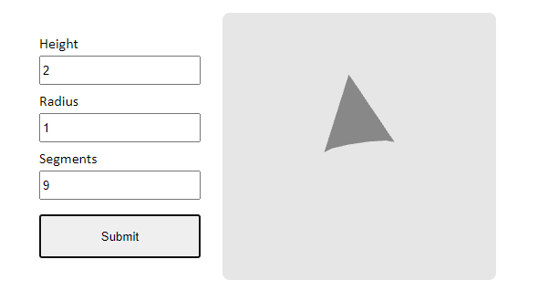

# About 
Fill form and get cone absolutely for free!

## Instruments
- Node.js
- Express.js
- Three.js
- Node-api addons
- C++
- Html, Css, Js

## How to try
You need any cli (cmd, iterm, ...), npm, git on your pc.
1. Open your cli
1. Paste `git clone https://github.com/bakhtyiar/3d_modelling.git` and enter
1. Paste `cd 3d_modelling` and enter
1. Paste `npm i` and enter
1. Paste `npm run start:dev` and enter
2. Wait minute for build
1. Open localhost:3000 in your browser
